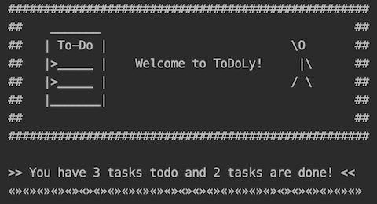

# Todo List
A simple backend logic **Todo List**  application written in Java. This application allows you to create new tasks, by adding title, short description, due date, and choose a project for that task to belong to. You can use the application through a text-based interface via command-line. The application allows you to display, add, edit, mark as done or remove tasks. You can also quit and save the current task list to file, and then restart the application with the former state restored.

## ✔️  Features
* Add new task
* Update task
* Remove task
* Mark task as done
* Display and sort the list of tasks by due date or project 
   (Ascending/Depending)
* Save and load the tasks list to a file 



## User manual
This guide will help you learn the functions of very basic **To-do List** application and get started with a simple task management system to stay organised. 
Ones the program run, a **Main menu** is shown as below:


By typing one of the given options you can manipulate your tasks.
```python
No.0 -> Save and Quit
``` 
You can save the current task list to file and quit the application.
```python
No.1 -> Show  a list of existing tasks
```
By entering choice **1** you are entering to the sub menu *listing tasks* where you can choose from the available options
```python
No.2 -> Add a new task 
```
By entering choice **2** you can create a new task record, by providing  *name* , *short description*, *project title* and *due date* for the particular task.

Current requirement is that, *Due date* needs to be entered in specific format *yyyy M d*
```python
No.3 -> Update an existing task 
```
By entering choice *No.3* you will be asked to provide a name of the task you want to edit. After typing existing name you are entering to the sub menu where you can choose from the available options, change *name*, *change description*, *change project*, *change due date*  or *change status*(which swaps between two states: In progress or Done)
```python
No.4 -> Remove an existing task
```
By entering choice *No.4* you can remove task from your list by providing a name of existing task. 
```python
No.5 -> Query if any existing task exist in your list
```
By entering choice *No.5* you can find if task exist in your list by providing a name of a task. 
```python
No.6 -> Print a list of available actions
```
By entering choice *No.6* you can print the **Main menu**.
